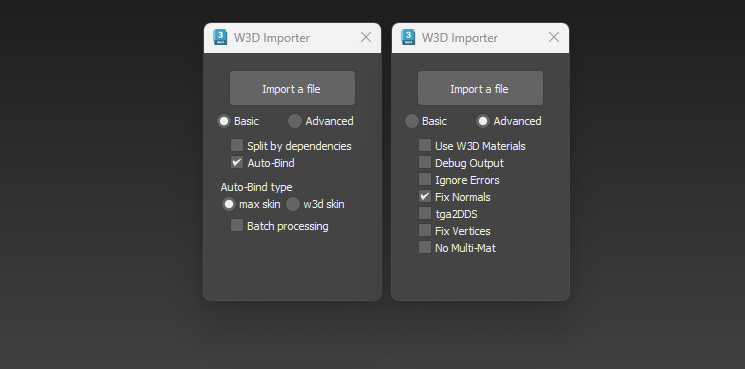

# w3dimporter

A MAXScript importer for Westwood 3D (`.w3d`) files in 3ds Max / gMax.

Originally scripted by **coolfile**, edited and augmented by **NDC**, further edited by **tria**.

Tested on 3ds Max 2023.

- [w3dimporter](#w3dimporter)
  - [Usage](#usage)
  - [Changelog (v17 vs v11)](#changelog-v17-vs-v11)
    - [Import extended W3D Info](#import-extended-w3d-info)
    - [Pivots dropdown (Basic tab)](#pivots-dropdown-basic-tab)
    - [External skeleton popup](#external-skeleton-popup)
    - [Use 3dsMax8 Normals now works on WWSkin meshes](#use-3dsmax8-normals-now-works-on-wwskin-meshes)
    - [Credits](#credits)
  - [Changelog (v11 vs v10)](#changelog-v11-vs-v10)
    - [Use 3dsMax8 Normals](#use-3dsmax8-normals)
  - [Changelog (v10 vs v8)](#changelog-v10-vs-v8)
  - [Changelog (v8 vs v7)](#changelog-v8-vs-v7)
    - [Bit-channel visibility import bug](#bit-channel-visibility-import-bug)
    - ["Ignore Errors" → "Strict Mode"](#ignore-errors--strict-mode)
  - [Changelog (v7 vs v6)](#changelog-v7-vs-v6)
    - [Known limitation (carried from v6)](#known-limitation-carried-from-v6)
  - [Changelog (v6 vs v5)](#changelog-v6-vs-v5)
    - [Two-tab dialog layout](#two-tab-dialog-layout)
    - [Fix Normals](#fix-normals)
    - [Fix Vertices](#fix-vertices)
    - [tga2DDS](#tga2dds)
    - [No Multi-Mat](#no-multi-mat)
    - [Single material with two texture stages (auto-detect)](#single-material-with-two-texture-stages-auto-detect)
    - [Pass / binding ordering](#pass--binding-ordering)
    - [Default diffuse `alphaSource = None` for opaque meshes](#default-diffuse-alphasource--none-for-opaque-meshes)
    - [Per-sub blend mode debug + tab-aware UI](#per-sub-blend-mode-debug--tab-aware-ui)
    - [Reload helper](#reload-helper)
  - [Changelog (v5 vs v3.1)](#changelog-v5-vs-v31)
    - [W3D material support](#w3d-material-support)
    - [Per-shader blend mode mapping](#per-shader-blend-mode-mapping)
    - [Per-sub-material blend mode picking](#per-sub-material-blend-mode-picking)
    - [AlphaTest detection ordering](#alphatest-detection-ordering)
    - [Ignore errors checkbox](#ignore-errors-checkbox)
    - [Expanded debug output](#expanded-debug-output)
    - [Other small fixes](#other-small-fixes)
    - [Known limitation: no multi-pass W3DMaterial output](#known-limitation-no-multi-pass-w3dmaterial-output)
  - [Changelog (v3.1 vs v2.0)](#changelog-v31-vs-v20)
    - [Multi-texture meshes](#multi-texture-meshes)
    - [Alpha textures](#alpha-textures)
    - [Additive textures](#additive-textures)
    - [Debug output toggle](#debug-output-toggle)
  - [License](#license)

---

<h2>Usage</h2>

1. Run `w3dimporter.ms` in 3ds Max (Scripting → Run Script).
2. The "W3D Importer" dialog opens. Click **Import a file** and pick a `.w3d`.
3. The dialog has two tabs:
   - **Basic** — Split by dependencies, Auto-Bind, Auto-Bind type (max skin / w3d skin), Batch processing.
   - **Advanced** — Use W3D Materials, Debug Output, Strict Mode, Fix Normals, tga2DDS (with `rev` companion), Fix Vertices, No Multi-Mat.

If a runtime error inside an import leaves the dialog's buttons unresponsive, type `w3di.reload()` in the MAXScript Listener to rebuild the dialog.

<h2>Changelog (v17 vs v11)</h2>

### Import extended W3D Info

New **Import extended W3D Info** checkbox (Advanced tab, off by default). When enabled, each imported mesh has its W3D Tools panel populated from the source `W3D_MESH_HEADER3.Attributes` and `SortLevel`: Geometry Type (Normal / CamParallel / Skin / AABox / OBBox / CamOriented / CamZOriented), geometry flags (Hide, 2-Sided, CastShadow, Shatter, Tangents, Prelit, AlwaysDynLight), collision flags (Physical / Projectile / Vis / Camera / Vehicle), and Static Sort Level. W3DBOX collision boxes get the same decode (Aligned / Oriented + collision bits). Without this pass, imported meshes always read back as the default (Normal, no flags) regardless of what the source `.w3d` encoded. Requires the rebuilt `max2w3d.dle` (provides `wwSetFlags` / `wwSetSorting`).

### Pivots dropdown (Basic tab)

New **Pivots:** dropdown on the Basic tab to control how hierarchy pivots are represented in the scene:

- **Bone (default)** — original importer behaviour, Max bone object.
- **Sphere** — V1.16-style green sphere. Visually distinctive but `max2w3d.dle` treats it as render geometry, so the exporter / Select Bones won't classify it as a bone — beware.
- **Point Helper** — small helper marker. Uses `HELPER_CLASS_ID`, so W3D Tools' Select Bones picks it up as a bone and it stays out of the geometry export. Recommended alternative when bones are visually noisy.

Sphere / Point Helper marker sizes auto-scale from the imported meshes' bbox diagonal (~2% / ~4%, with a sensible floor) so they stay readable across infantry, vehicles, and structures without a per-import scale knob.

### External skeleton popup

When the HLOD header references an external rig (HTree name differs from the HLOD name and ends in `_SKL`, the W3D convention for standalone skeleton files), the importer now surfaces a message box naming the expected skeleton — matching the V1.16 reference importer's behaviour. Fires regardless of whether the auto-derive step located the rig on disk; the import succeeds either way, but the popup makes the dependency obvious for infantry models (which always declare an HTree).

### Use 3dsMax8 Normals now works on WWSkin meshes

The `wwMakeNormalsExplicit` skip list is narrowed to native **Skin / Physique** only. Previously WWSkin was skipped too. The rebuilt `SkinModifierClass::ModifyObject` in `max2w3d.dle` now (a) sets `MESH_NORMAL_MODIFIER_SUPPORT` so Max doesn't auto-clear Explicit normals, and (b) re-skins each Explicit base-mesh normal by `Inverse(baseTM) * curTM` of its driving bone every evaluation, so explicit normals follow the rig instead of staying frozen in bind pose. Skin / Physique still recompute normals on evaluation and discard explicit base-mesh normals, so they remain skipped.

### Credits

Header comment updated to credit **Seagle & Sloth** for the v11→v17 contributions.

<h2>Changelog (v11 vs v10)</h2>

### Use 3dsMax8 Normals

New **Use 3dsMax8 Normals** checkbox (Advanced tab, on by default). After import, promotes the per-vertex normals written from the W3D file to Explicit in the base mesh's `MeshNormalSpec` via the `wwMakeNormalsExplicit` primitive in the rebuilt `max2w3d.dle`. Without this, Max 2023's Nitrous renderer re-derives normals from smoothing groups, making imported meshes look different from Max 8 (which used the legacy `RVertex/RNormal` path directly).

Mutually exclusive with Fix Normals (the UI enforces this). Skinned meshes (Skin / Physique on the modifier stack) are skipped automatically — the Skin modifier recomputes normals on evaluation and discards the base mesh's explicit normals. Requires the rebuilt `max2w3d.dle`.

<h2>Changelog (v10 vs v8)</h2>

- **WWSKIN Ported.** Support for importing legacy WWSKIN skin;bones has been ported and integrated.
- **External Skeleton**.  W3D files don't always carry their own bones. A character .w3d (e.g.
  usinftroop.w3d) typically contains only meshes + an HLOD chunk that names a
  skeleton — like "GDIRIFLEMAN_SKL". The importer normally tries to find
  GDIRIFLEMAN_SKL.w3d sitting next to the mesh and load bones from there. If it
  can't find it, it pops up a file picker.
- **Added "Use2023WWSkin"**  checkbox which is very similar to the basic use w3d skin but with some changes.
- **Multi-pass W3DMaterial Limitation Removed.** The hard limitation preventing the creation of true multi-pass W3DMaterials (which previously forced multi-texture/multi-shader meshes into 3ds Max multi-materials) has been completely resolved. True multi-pass W3DMaterials are now generated natively. *Requires the updated exporter/tools from [https://github.com/triatomic/max2w3d](https://github.com/triatomic/max2w3d).*
- **Various bugfixes.**

<h2>Changelog (v8 vs v7)</h2>

**Highlight: animation import fixed.** Models with bit-channel visibility animation now round-trip correctly through 3ds Max — they render correctly in 3ds Max, in W3DView, and in-game.

### Bit-channel visibility import bug

The bit-channel handler created an `On_Off` controller with a single key at frame 0 with value `1`. With 3ds Max's default playable timeline starting at frame 1, that controller evaluates to `false` across the entire timeline (verified: `at time 1f (b.visibility)` returned `false`). On re-export, `node->GetVisibility(t)` reported the bone as hidden at every frame, baking "hidden everywhere" into the bit channel — making the round-tripped model **completely invisible in-game**.

The handler now:
- **Pre-scans the channel** and only creates an `On_Off` controller when the bit data actually changes. Constant "always visible" channels leave `.visibility` as the static default, which matches the conventional 3ds Max workflow and lets the exporter fall back to its `floatvis = 1.0` default.
- **No longer seeds a frame-0 key** for animated channels; keys go directly at the transition frames.
- **Places transition keys at frame `f`** instead of `f+1`, removing the off-by-one frame shift that showed up as `frames=0..150` instead of `frames=1..150` in re-export dumps.
- **Uses `.value`** instead of `.selected` for `On_Off` keys (the correct property — `.selected` is scene-selection state, not the key's value).

As a side effect, the 39 spurious `ANIM_CHANNEL_VIS` motion channels that re-exports were producing alongside the bit channels also disappear: they only get emitted when `GetVisibility` returns non-`1.0` values, which the broken `On_Off` was causing on every frame.

### "Ignore Errors" → "Strict Mode"

The Advanced-tab `Ignore Errors` checkbox is renamed to `Strict Mode` and the polarity inverted:

- **Strict Mode off (default)** — `pivotID == 0` (ROOTTRANSFORM, by design not in the scene-bone array) and out-of-range pivot IDs are silently skipped. Matches what the motion-channel loop already did via `try`/`catch` for the same condition.
- **Strict Mode on** — the importer halts on a bad pivot ID, for users who want to be told when something is malformed.

The previous default (`Ignore Errors` unchecked) caused the importer to abort on the very first bit channel of any file containing a `W3D_CHUNK_BIT_CHANNEL` for `pivotID == 0` (root visibility, present in many files), with the message *"array index must be positive number, got: 0"*.

<h2>Changelog (v7 vs v6)</h2>

- **Multi-pass mesh support.** The importer now reads every `MATERIAL_PASS` chunk in a mesh (was discarding all but the last). Two-pass meshes get a 2-sub MultiMaterial preserving W3D pass order so re-export round-trips correctly.
- **Viewport matches W3DView for AlphaBlend overlays.** When pass 2 is AlphaBlend, face matIDs are pointed at the AlphaBlend sub so the textured overlay shows instead of the underlay.
- **Glow fix for true multi-sub meshes.** Standard-material multi-sub now classifies each sub independently — only `_G` glow subs get opacity+self-illum wired, base subs render normally instead of going black. Orphan textures (in the W3D table but not face-referenced) default to Opaque, with `_G`-suffix textures defaulting to Add.
- **`rev` companion to tga2DDS.** A new `rev` checkbox sits next to tga2DDS (disabled until tga2DDS is checked). Enabling `rev` flips the rewrite direction so `.dds` references become `.tga` instead of the default `.tga` → `.dds`.
- **Pass-aware debug log.** `=== Mesh: NAME ===` now prints `matlheader: passCount=N` and per-pass `txIds/vmIds/shaderIds` so it's clear which faces use which (vertMatl, shader, texture) per pass.

### Known limitation (carried from v6)

> **Resolved in v10:** True multi-pass W3DMaterials are now fully supported. Requires the updated tools from [https://github.com/triatomic/max2w3d](https://github.com/triatomic/max2w3d).

Meshes that combine a base diffuse texture with a glow texture as a second additive pass cannot be re-exported back as a true two-pass W3D, and the 3ds Max viewport cannot reproduce the engine's pass-1-then-pass-2 composite (3ds Max draws one material per face; W3D's runtime overlays multiple passes per draw). Pass 2+ of `W3DMaterial` is UI-only and not writable from MAXScript. The importer uses a multi-sub MultiMaterial as the workaround, which preserves the data structurally but exports as a multi-sub mesh rather than a multi-pass mesh. To author a true multi-pass W3DMaterial for export, the second pass must be set manually in the Material Editor.

<h2>Changelog (v6 vs v5)</h2>

### Two-tab dialog layout
The import options have been split across **Basic** and **Advanced** tabs (radio-button switcher at the top of the dialog), keeping the window compact while making room for the new Advanced toggles below.

### Fix Normals
Adds an Edit Normals modifier to each imported mesh and applies the exact "Reset Normals" sequence that the user would otherwise run by hand (subobject toggle → SetSelection #{1..N} → Reset). Without this, 3ds Max ignores the W3D-supplied per-vertex normals and the model looks faceted until you reset normals manually via the W3D Tools modifier. Smoothing-group baseline is set to group 1 first so the reset has consistent input.

### Fix Vertices
For each non-skinned mesh:
1. Clears all existing smoothing groups.
2. Assigns one unique smoothing group per connected element (cycling 1..32 if the mesh has more than 32 elements).
3. Welds vertices at a fixed 0.01 threshold via `meshOp.weldVertsByThreshold`.

Smoothing-group flags travel with each face through the weld, so faces from the same original element stay smooth across the seam, and faces from different elements keep their hard edges. Skinned meshes (Skin / Physique on the stack) are skipped automatically because welding renumbers/removes vertices and would silently break Skin's per-vertex weight binding.

### tga2DDS
Rewrites every `.tga` extension on imported texture references to `.dds` (case-insensitive match, filename preserved). Useful when a W3D file references TGA textures that have since been re-exported as DDS.

### No Multi-Mat
Splits meshes that would otherwise become multi-materials into separate mesh objects, one per matID actually used. Each split node is built directly from the W3D source data (verts, faces, normals, txCoords) with the matching single sub-material assigned, the original transform/parent copied, and named `OriginalName [matID N]`. The original multi-material node is replaced; downstream post-processing (skin, normals reset, fix vertices, HLOD reparent) still operates correctly because `gmMeshes[i]` is rebound to the first split node.

### Single material with two texture stages (auto-detect)
When a mesh has 1 vertex material + 1 shader + 2 textures and the vertex material's `attrs` bitfield (or `vmArgs1`) signals stage-1 usage, the importer now builds a single W3DMaterial with stage 0 = texture[1] and stage 1 = texture[2] instead of splitting into a multi-material. Matches the engine's actual rendering: e.g. SHIELDS uses LinearOffset on both stages with different mapper args, and only renders correctly as a single two-stage material.

### Pass / binding ordering
Fix Vertices and Fix Normals are now deferred to run **after** the Auto-Bind pass (max skin / w3d skin). The original code ran them mid-loop, before binding, which:
- Caused Skin to bind to a post-weld vertex topology (wrong weights).
- Caused Skin to be stacked on top of Edit Normals, which interferes with weight calculation.

With the new order: bind first, then mutate geometry/normals on top.

### Default diffuse `alphaSource = None` for opaque meshes
The Standard-material path now sets `diffuseTex.alphaSource = 2` (None) unconditionally on the diffuse bitmap, so opaque meshes don't accidentally render transparent when the bitmap carries an alpha channel. The alpha and additive branches still wire opacity maps the same way as before.

### Per-sub blend mode debug + tab-aware UI
- The per-sub-material debug line in multi-material meshes now prints the literal blend-mode label alongside the integer (`-> sub[2] tex=... picked blendmode=1 (Add)`).
- The shader-row debug renamed `depthMask=` to `WriteZBuffer=` to match the W3DMaterial vocabulary.
- Vertex-material debug now lists ambient/diffuse/specular/emissive on their own lines, plus opacity, translucency, shininess, and the decoded `stage0mapping` / `stage1mapping` (integer + literal name from the `W3DMaterialMappingType` enum), `stage0mappingargs` / `stage1mappingargs`, plus defaults for fields the W3D file doesn't carry (`stage0/1mappinguvchannel`, `speculartodiffuse`).

### Reload helper
Type `w3di.reload()` in the MAXScript Listener to recover from a stuck dialog after a runtime error. (The dialog's own buttons can't recover themselves because the runtime error leaves the rollout's event-handler thread hung; recovery has to come from outside the broken dialog.)

<h2>Changelog (v5 vs v3.1)</h2>

### W3D material support
New **Use W3D materials** checkbox. When the W3D Tools `W3DMaterial` plugin is installed, the importer builds W3DMaterials instead of Standard materials, with the following wired in from the W3D file:

- **Vertex material colors** — ambient, diffuse, specular, emissive
- **Vertex material scalars** — opacity, translucency, shininess
- **Stage 0 / Stage 1 mapping types** — decoded from `vmInfo.attrs` bits 8–15 and 16–23 (UV, Environment, ClassicEnvironment, Screen, LinearOffset, Silhouette, Scale, Grid, Rotate, Sine, Step, ZigZag, WSClassicEnv, WSEnvironment, GridClassicEnv, GridEnvironment, Random, Edge, BumpEnv, GridWSClassicEnv, GridWSEnv)
- **Stage 0 / Stage 1 mapping args** — copied from `VERTEX_MAPPER_ARGS0` / `VERTEX_MAPPER_ARGS1` chunks
- **Stage 0 texture** — assigned with `stage0texenabled = on`, `stage0display = on` (visible in viewport)
- **Defaults for fields not stored in W3D** — `stage0/1mappinguvchannel = 1`, `speculartodiffuse = off`

### Per-shader blend mode mapping

Each W3D shader's `srcBlend` / `destBlend` / `alphaTest` is mapped to the matching W3DMaterial blend mode:

| W3D shader                                            | W3DMaterial blendmode                      |
| ----------------------------------------------------- | ------------------------------------------ |
| `srcBlend=ONE`, `destBlend=ZERO`                      | `Opaque (0)`                               |
| `srcBlend=ONE`, `destBlend=ONE`                       | `Add (1)`                                  |
| `srcBlend=ZERO`, `destBlend=SRC_COLOR`                | `Multiply (2)`                             |
| `srcBlend=ONE`, `destBlend=SRC_COLOR`                 | `MultiplyAndAdd (3)`                       |
| `srcBlend=ONE`, `destBlend=ONE_MINUS_SRC_COLOR`       | `Screen (4)`                               |
| `srcBlend=SRC_ALPHA`, `destBlend=ONE_MINUS_SRC_ALPHA` | `AlphaBlend (5)`                           |
| any with `alphaTest != 0`                             | `AlphaTest (6)` or `AlphaTestAndBlend (7)` |
| anything else                                         | `Custom (8)`                               |

`Add`, `AlphaBlend`, and `AlphaTestAndBlend` also explicitly write `blendmodesrc`, `blendmodedest`, and force `customblendwritezbuffer = off` so the material renders correctly without manual fix-up.

### Per-sub-material blend mode picking

For multi-texture meshes that build a multi-material, each sub-material now gets its own blend mode picked from the shader its faces actually reference (`pickBlendModeForSub`), instead of the whole mesh inheriting a single mesh-level mode. Fixes the bug where an opaque sub-material would inherit its parent's `Add` mode (or vice versa).

Handles three matlPass encodings:

- Single-shader meshes (`shaderIds.count == 1` and `shaders.count == 1`) — every sub uses the one shader.
- Short-form multi-shader meshes (`shaderIds.count == 1` but `shaders.count > 1`) — sub `N` maps to `shaders[N]`.
- Per-face shader meshes (`shaderIds.count > 1`) — walks the faces, collects shaders for each sub's `txIds`, and promotes toward the strongest (Add wins).

### AlphaTest detection ordering

`alphaTest != 0` is now checked **before** the `srcBlend=ONE, destBlend=ZERO` opaque pattern. The W3D `SC_ATEST_2D` preset uses the same blend factors as opaque and only differs by the `alphaTest` flag, so the previous order classified alpha-test meshes as opaque. Fixed in all four classification sites.

### Ignore errors checkbox

New checkbox (unchecked by default) in the import dialog. When enabled, the bit-channel animation loop skips entries whose `pivotID` is `0` or out of range, instead of erroring with `array index must be positive number, got: 0`. Use this when an asset's visibility track references `ROOTTRANSFORM` (pivotID 0) and you want the rest of the import to succeed.

*NOTE: this is destructive to the model shown in the 3dsmax viewport the model will look wrong; exported model should be fine. Proceed with caution.*

### Expanded debug output

The **Debug output** checkbox now also prints, per mesh:

- Each shader's literal blend-mode label (Opaque / Add / Multiply / AlphaBlend / AlphaTest / etc.) alongside the raw values
- Each vertex material's colors, opacity, translucency, shininess
- Each vertex material's `attrs` bitfield with decoded `stage0mapping` / `stage1mapping` (integer + name)
- Each vertex material's `stage0mappingargs` / `stage1mappingargs` strings
- Per-sub-material blend mode picks for multi-material meshes (texture name + integer + label)
- The final W3DMaterial blendmode the mesh would receive

### Other small fixes

- Stage 0 textures show in the viewport (`stage0display = on`).
- The "alpha" / "additive" mesh classification now uses the engine's actual `Uses_Alpha()` rule (`destBlend ∈ {SRC_ALPHA, ONE_MINUS_SRC_ALPHA}` or `srcBlend ∈ {SRC_ALPHA, ONE_MINUS_SRC_ALPHA}`), matching `shader.h`.

### Known limitation: no multi-pass W3DMaterial output

> **Resolved in v10:** True multi-pass W3DMaterials are now fully supported. Requires the updated tools from [https://github.com/triatomic/max2w3d](https://github.com/triatomic/max2w3d).

The W3DMaterial plugin supports up to 4 passes per material, with each pass holding its own texture, blend mode, and shader settings. The W3D file format encodes this as multiple shader entries per mesh — e.g. an "Opaque base + Additive glow" mesh ships two shaders and two textures meant to render in two passes on a single material.

**The importer cannot produce multi-pass W3DMaterials.** This is a hard limitation imposed by how the W3DMaterial plugin exposes itself to MAXScript, not a missing feature in the importer:

- `getNumParamBlocks` and `getNumRefs` both return `0` on a `W3DMaterial` instance — the per-pass param blocks are not reachable through MAXScript's standard plugin reflection.
- `showProperties` on the material lists every per-pass property (`blendmode`, `stage0texturemap`, etc.) **four times** — once per pass — but with identical names. Dotted access (`m.blendmode = X`) and `setProperty` only ever hit the **first** occurrence (pass 1).
- There is no `m.passone` / `m.passtwo` / pass-indexed accessor exposed to script.

This was confirmed empirically by walking the material's exposed surface during import (see the `[probe]` lines in the debug log if you want to reproduce). Without a per-pass write API, the importer cannot set pass 2/3/4's texture or blend mode from script.

**What happens instead:** when a mesh has 2+ textures and 2+ distinct shaders, the importer falls back to building a 3ds Max **multi-material** with one W3DMaterial sub per texture, each correctly configured with its own blend mode (via `pickBlendModeForSub`). Per-face material IDs are assigned from `txIds` so each face uses the right sub. Visually this looks correct in 3ds Max, but it is **not a round-trip-safe representation** of the original W3D mesh — re-exporting through the W3D Tools exporter will write multiple separate single-pass materials, not the original multi-pass one.

If you need to preserve multi-pass W3DMaterials, you have to author/edit them by hand in 3ds Max after import.

<h2>Changelog (v3.1 vs v2.0)</h2>

### Multi-texture meshes

Meshes that reference more than one texture now produce a `MultiSubObjectMaterial`
with one Standard sub-material per texture. Per-face material IDs are assigned from
the W3D `txIds` array (W3D_CHUNK_TEXTURE_IDS), so each face renders with the right
texture instead of all faces collapsing onto texture[0].

### Alpha textures

When the mesh's shader signals alpha usage — i.e. `alphaTest != 0`, or `srcBlend` /
`destBlend` references `SRC_ALPHA` / `ONE_MINUS_SRC_ALPHA` — the importer:
- Sets the diffuse bitmap's `alphaSource = 2` (None / Opaque) so the diffuse channel
  ignores its own alpha.
- Wires a second instance of the same bitmap into the Opacity slot with
  `monoOutput = 1` (Alpha), so only the opacity map drives transparency.

The detection rule mirrors `ShaderClass::Uses_Alpha()` from the engine's `shader.h`.

### Additive textures

When the mesh's shader matches the W3D `SC_ADDITIVE` preset
(`srcBlend = ONE (1)` and `destBlend = ONE (1)`), the importer:
- Wires the texture into the Opacity slot.
- Wires the texture into the Self-Illumination slot.
- Sets `useSelfIllumColor = true` so the self-illumination is driven by the map.

### Debug output toggle

New checkbox under "Auto-Bind" in the import dialog. When enabled, every imported
mesh prints to the Listener:
- `vertMatls.count`, `textures.count`, and each texture filename
- `txIds` and `vmIds` arrays from the material pass
- Per-shader `srcBlend`, `destBlend`, `alphaTest`, `depthMask`, plus an `alpha=` and
  `additive=` verdict for that shader
- Final mesh-level `meshUsesAlpha` and `meshIsAdditive` rollups

Useful for diagnosing why a particular asset isn't getting alpha or additive wiring.

<h2>License</h2>

Original script © coolfile. Modifications released under the same terms.

